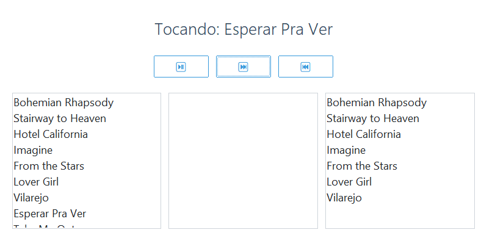

# NepsMusic Player  
*(Based on the exercise [Neps Music Player](https://neps.academy/br/course/fundamentos-das-estruturas-de-dados/lesson/neps-music-player) from [Neps Academy](https://neps.academy))*

This project was developed based on the **Neps Music Player** exercise from **Neps Academy**.  
It is a simple desktop application written in **Python** that simulates a music player, focusing on the use of **fundamental data structures** rather than real audio processing. The project emphasizes **state management**, **queues**, **stacks**, and **dictionaries**, while offering a clean and visually pleasant graphical interface built with **ttkbootstrap**.

---

## Features
- Load a music library from a CSV file;
- Display all available songs;
- Add songs to a **Play Next** queue (FIFO);
- Prioritize queued songs during playback;
- Navigate back using a playback history (LIFO);
- Simulate play, pause, next, and previous actions;

> **Note**  
> This application does **not play real audio files**. Playback is simulated to focus on data structures and application logic.

---

## Data Structures Used

- **Dictionary (`dict`)**  
  Used to store the music library, with the song title as the key.

- **FIFO Queue (`queue.SimpleQueue`)**  
  Implements the **Play Next** functionality.

- **LIFO Stack (`queue.LifoQueue`)**  
  Stores the playback history, allowing navigation to previous songs.

---

## Interface

Below is a preview of the application's interface:



---

## How to Run

Follow the steps below to run the project locally.

```bash
git clone https://github.com/maaluuzete/neps-music-player.git
cd neps-music-player
python -m venv venv
pip install -r requirements.txt
python main.py
```
## Project Structure
```
neps-music-player/
│── main.py
│── songs.csv
│── requirements.txt
│── README.md
│── LICENSE
│── home.png
```
### File Description
- `main.py` application logic and graphical interface;
- `songs.csv` initial music library;
- `requirements.txt` project dependencies;
- `README.md` project documentation;
- `LICENSE` license information;
- `home.png` screenshot of the application interface.
